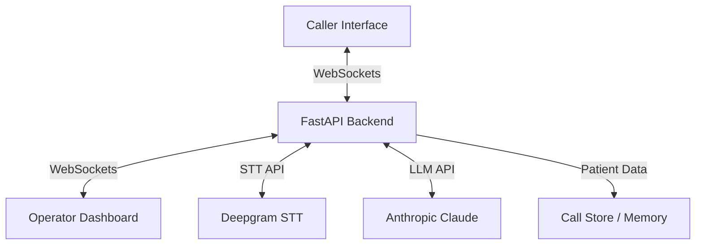

# OperationEMT 🚑

AI-powered Emergency Medical Services (EMS) Dispatch System.

OperationEMT leverages real-time transcription and advanced Large Language Models (LLMs) to streamline the emergency call-taking process, providing automated triage and patient monitoring to assist dispatch operators.

## ✨ Key Features

- **Real-time Transcription**: Powered by **Deepgram STT**, converting emergency calls into text instantaneously.
- **Automated Patient Triage**: Utilizes **Anthropic Claude (Haiku)** to extract structured patient data (Name, Age, Location, Condition, Allergies) and assign **PACS (Patient Acuity Category Scale)** triage levels (P1+ to P4).
- **Smart Hold Monitoring**: AI-driven "Smart Hold" that listens for signs of patient deterioration while callers are on hold, triggering alerts for the operator.
- **Operator Dashboard**: A modern React-based interface for dispatchers to manage incoming calls, view automated triage data, and monitor patient status in real-time.
- **Caller Interface**: Specialized web interface for the caller side, simulating real emergency call scenarios.

## 🛠️ Project Architecture



- **`backend/`**: FastAPI implementation, LLM/STT service integrations, and WebSocket-based state management.
- **`frontend/dashboard/`**: Vite-powered React application for dispatch operators.
- **`frontend/caller/`**: Lightweight vanilla JS interface for emergency callers.
- **`tests/`**: Backend service validation suite.

## 🚀 Getting Started

### Prerequisites

- Python 3.9+
- Node.js & npm
- [Deepgram API Key](https://deepgram.com/)
- [Anthropic API Key](https://www.anthropic.com/)

### Backend Setup

1. **Install Dependencies**:
   ```bash
   cd backend
   pip install -r requirements.txt
   ```
2. **Environment Configuration**:
   Create a `.env` file in the `backend/` directory with the following variables:
   ```env
   DEEPGRAM_API_KEY=your_key
   ANTHROPIC_API_KEY=your_key
   ```
3. **Run the Application**:
   ```bash
   # From the root directory
   uvicorn backend.main:app --reload
   ```

### Frontend Dashboard Setup

1. **Install Dependencies**:
   ```bash
   cd frontend/dashboard
   npm install
   ```
2. **Launch Dev Server**:
   ```bash
   npm run dev
   ```
3. **Build (for Backend serving)**:
   ```bash
   # To serve via the FastAPI backend, build first:
   npm run build
   ```

## 🧪 Testing

Run the backend test suite:
```bash
pytest tests/
```

## 📖 How It Works

1. **Incoming Call**: A caller connects via the Caller Interface.
2. **Real-time Transcription**: Audio is streamed to Deepgram for low-latency transcription.
3. **Automated Triage**: As the transcript evolves, Claude extracts patient details and assigns a PACS level.
4. **Dashboard Update**: Dispatchers see the incoming call and triaged data immediately.
5. **Smart Hold**: If the operator is busy, the Smart Hold system continues monitoring the transcript for any NEW deterioration symptoms or deterioration in PACS level, alerting the dispatcher if necessary.
